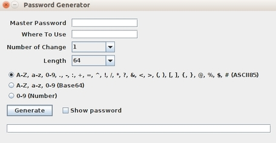

# Password Generator

Generates passwords for different web pages based on a master password. You can generate strong passwords by remembering only a master password and the name of the web site. It automatically copies the password to clipboard if you don't choose the option 'show password'.

It first hashes MasterPassword + WhereToUse + NumberOfChanges using SHA512. Then, encodes the result using one of the three options (ASCII85, Base64, Numeric). Finally, trims the end of the string to fit the desired length.



For instance, if you want to generate a password to use in GitHub, you can enter:

```
Master Password: <your master password>
Where To Use: github
Number Of Changes: 1
Length: 32
```
And to generate a password to use in Google, you can enter:
```
Master Password: <same master password>
Where To Use: google
Number Of Changes: 1
Length: 64
```
If you want to change your password after a while you can simply increment the Number Of Changes.

## Getting Started

### Prerequisites

You may need to install Java Cryptography Extension (JCE) Unlimited Strength Jurisdiction Policy Files.
* [Unlimited Strength Jurisdiction Policy Files](http://www.oracle.com/technetwork/java/javase/downloads/jce8-download-2133166.html)

## Running

You can easily compile and run using javac and java commands.

```
javac Gui.java
java Gui
```
Or run by double-clicking to password-generator.jar file.